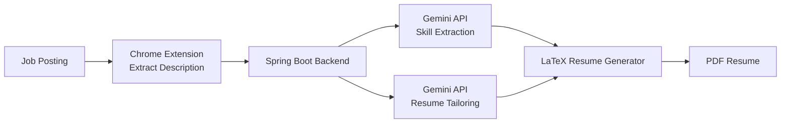

# AI Resume Tailor 

An AI-powered resume tailoring platform that analyzes job descriptions and generates customized resumes using LLMs.

The system extracts relevant skills from job postings, rewrites resume content to better match job requirements, and compiles a professionally formatted LaTeX resume into a downloadable PDF.

A Chrome extension allows users to extract job descriptions directly from job listing pages and generate tailored resumes with one click.

```markdown
## Architecture



## Tech Stack
#### Backend
• Java
• Spring Boot
• Jackson (JSON parsing)
• RestTemplate for API calls
#### AI
• Google Gemini API
#### Resume Generation
• LaTeX
• pdflatex
#### Frontend / Integration
• Chrome Extension
• JavaScript
